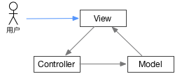
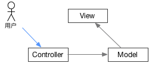
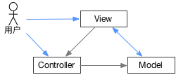

前端的MVX框架
----

前端工程化，工程就有架构，前端的架构基本上都是围绕着MVC模式展开的。

#MVC

MVC模式最早由Trygve Reenskaug在1978年提出，是施乐帕罗奥多研究中心（Xerox PARC）在20世纪80年代为程序语言Smalltalk发明的一种软件架构。MVC的三个字母含义如下：

* M: Model，模型负责数据部分
* V: View，视图负责界面部分
* C: Controller，控制器负责业务逻辑部分

三者交互关系如下图：

在实际使用中，需要加入用户交互，用户介入点有两个。从视图和从控制器进入，分别如下：

用户操作视图层，这种方式不会改变MVC种三者的通讯方式。

用户操作控制器层，在这种模式下，视图和控制器之间的通讯就不再需要了。控制器通知Model更新数据，然后视图中重新呈现修改后的数据即可。这种方式的操作流图看上去很完美，但实际使用中很难做到，怎么可能用户完全不操作界面呢？这太难了。

上面两种是理论上的模式，实际使用中有时会出现更加复杂的模式，例如下面这种：

用户和view、controller都有交互，并且view和model之间双向通讯。

简单才是天才们追寻的终极目标，由于实际中的MVC太过复杂，后来人们提出了新架构来改善它。

#MVP

MVP (Model-View-Presenter)，是对MVC模式进行的改进，最初由Taligent公司提出的概念。

在MVP种，用Presenter代替了MVC中的Controller。

从图上可以看出来，在MVP中，视图和模型完全分开，不再直接进行通信，这样做的好处是解耦，更方便做单独的视图组件。

Presenter可以看作是View和Model之间的中间人，除了基本的业务逻辑外，还需要大量代码处理从View到Model和从Model到View的数据进行“手动同步”，这样Presenter显得很重，不便维护。而且由于没有数据绑定，如果Presenter对视图渲染的需求增多，它不得不过多关注特定的视图，一旦视图需求发生改变，Presenter也需要改动。

为了改进MVP中Presenter的缺点，有人提出了MVVM。

> MVP是很多短语的缩写，在不同的场合下有很多不同的含义，它可能是：
> 最有价值的球员(Most Valuable Player)；
> 微软最有价值专家 (Microsoft Most Valuable Professor，简称MVP)；
> 最简可行产品(Minimum Viable Product)，产品开发中的专用术语，指有部分机能，恰好可以让设计者表达其核心设计概念的产品；
> 医学中的一种心脏疾病：僧帽瓣脱垂（Mitral Valve Prolapse）；甚至2017年韩国出道的一个乐队也自称MVP来凑热闹。
    
#MVVM

MVVM (Model-View-ViewModel)是由微软架构师提出的概念，并与2005首次发表。在MVVM中，View和Model的同步逻辑会交由框架自动处理，不再需要手工编写代码。除用ViewModel取代了Presenter外，其它和MVP基本相同。View和ViewModel之间采用双向数据绑定，model中数据变化了，会自动在view中呈现，反之亦然。

VUE里就是用的MVVM这种方式，在一个扩展名是.vue的视图内，template部分是MVVM中的第一个V(View)，script部分中的data()则对应MVVM中的M(Model)，其余部分的script则对应VM(ViewModel)。如果要给style分布也归类，可放到View部分。

