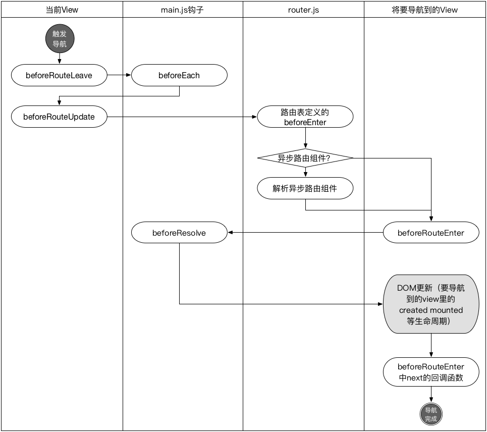

# 监听
====


## 全局事件/钩子 (导航守卫 Navigation Gurads)
可以在路由导航前后增加事件监测。例如如下情景就比较适合在导航前坚持：判断访问的页面是否需要登录，当前用户是否有权限等，如果不符合条件，则跳转到登录或无权限提示页面。

修改src/router.js文件，增加：

```JavaScript
router.beforeEach((to, from, next) => {
  //这里判断，如果继续处理，调用next()
  //如果重定向，调用next({path: '/newurl'})
  if(to.path !== '/'){
    next({path: '/'})
    return
  }
  next()
})
```

类似的事件还有：

* 全局
  * beforeEach
  * afterEach
* 单个路由的路由表定义 beforeEnter
  
  ```bash
  {
      path: '/foo',
      component: Foo,
      beforeEnter: (to, from, next) => {
        // ...
      }
    }
 ```
* 在view页面定义的路由
  * beforeRouteEnter
  * beforeRouteUpdate
  * beforeRouteLeave

### 事件执行顺序




## History

hash模式与history模式，这两种模式功能没什么区别，只有URL的表现形式有差异。

hash模式的url:

```
http://localhost:8080/#/foo
```

history模式:

```
http://localhost:8080/foo
```

hash模式是靠改变页面中的hash来实现的。

history模式的url看上去更'正常'些，这也是有人喜欢这种模式的原因，但这种模式部署到生产环境上的时候，需要对web服务器进行下设置，把对应目录下的所有请求都重定向到index.html上去。

例如NGINX下要做类似这样的配置：

```conf
location / {
  try_files $uri $uri/ /index.html;
}
```
